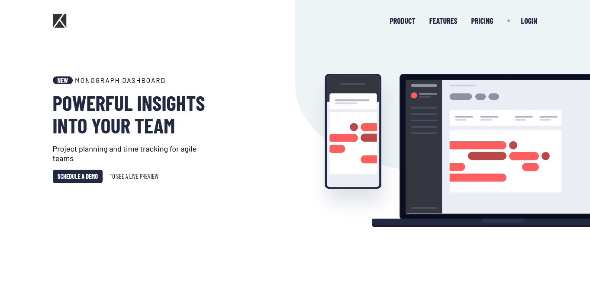

# Frontend Mentor - Project tracking intro component solution

This is a solution to the [Project tracking intro component challenge on Frontend Mentor](https://www.frontendmentor.io/challenges/project-tracking-intro-component-5d289097500fcb331a67d80e). Frontend Mentor challenges help you improve your coding skills by building realistic projects.

## Table of contents

- [Overview](#overview)
  - [The challenge](#the-challenge)
  - [Screenshot](#screenshot)
  - [Links](#links)
- [My process](#my-process)
  - [Built with](#built-with)
- [Author](#author)

## Overview

### The challenge

Users should be able to:

- View the optimal layout for the site depending on their device's screen size
- See hover states for all interactive elements on the page
- Create the background shape using code

### Screenshot

### Links

- Solution URL: [Frontend Mentor](https://www.frontendmentor.io/solutions/responsive-project-tracking-intro-component-using-html-css-and-js-7V0oarB4g7)
- Live Site URL: [Github Pages](https://bccpadge.github.io/project-tracking-intro-component/)

## My process

### Built with

## Author

## Acknowledgments

- [Responsive Navigation JavaScript Code](https://www.youtube.com/watch?v=zPHMqqyD2kY&list=PL4-IK0AVhVjNDRHoXGort7sDWcna8cGPA&index=5)

- [Escape container on only one side](https://www.youtube.com/watch?v=Ivk8Blw2VTI)
